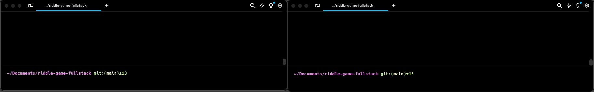

# Riddle Game Fullstack Project

## Project Overview
This Riddle Game is a fullstack application designed to entertain users by allowing them to solve riddles provided by the server. Each riddle comes with a set number of attempts and hints to assist the user in guessing the right word.




### Key Features:
- **TCP-based Communication:** The client and server communicate using TCP sockets, ensuring reliable and ordered message delivery.
- **Multi-threading:** The server handles multiple client connections simultaneously using multi-threading, allowing scalable client management.
- **MVC Architecture:** Implements the Model-View-Controller (MVC) design pattern to separate the application logic from the user interface, facilitating easier maintenance and scalability.
- **Object-Oriented Programming (OOP):** The application is developed using OOP principles to enhance modularity and simplicity in handling game logic, networking, and user interactions.

## Installation and Running
1. **Clone the repository:**
   ```bash
   git clone https://github.com/0xmisha/riddle-game-fullstack.git
   cd riddle-game-fullstack
    ```
2. **Build the project:**
   ```bash
   cmake -S . -B build -DBUILD_SERVER=ON -DBUILD_CLIENT=ON
   cmake --build build
   ```
3. **Run the server:**
    ```bash
   build/server/server
   ```

4. **Run the client:**
    ```bash
   build/server/riddle_client
   ```

### Documentation:
Available on https://0xmisha.github.io/riddle-game-fullstack/

## System and Utility Requirements
- **Operating System:** Compatible with Linux, Windows, and macOS.
- **Compiler:** Requires a C++ compiler that supports C++11 (e.g., GCC, Clang).
- **Libraries:** Requires the standard C++ library and POSIX libraries for networking and threading (on Unix-based systems).
- **Doxygen:** For generating project documentation from annotated source code.
- **Git:** For version control management.
